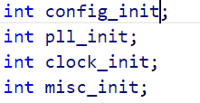
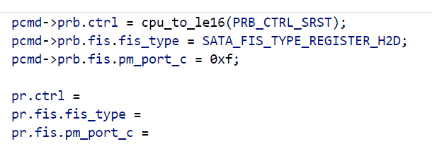
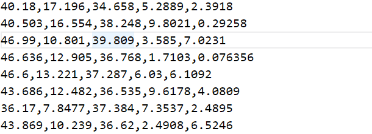

# Smart Multi-cursor
Context aware multi-cursor.  
Inserting cursor in the appropriate position on next line, if no pattern was found falling back to regular column based multi-cursor.  
The pattern search is based on:  
" ' = : , ; . ( ) [ ] < > \t

This extension overrides the default insertCursorBelow/Above keybindings:  
> Windows: <kbd>Ctrl</kbd>+<kbd>Alt</kbd>+<kbd>Down/Up</kbd>  
> Linux: <kbd>Shift</kbd>+<kbd>Alt</kbd>+<kbd>Down/Up</kbd>  
> Mac: <kbd>⌘</kbd>+<kbd>⌥</kbd>+<kbd>Down/Up</kbd>  

Tip: use <kbd>Ctrl</kbd>+<kbd>u</kbd> to undo last cursor (Mac: <kbd>⌘</kbd>+<kbd>u</kbd>).

## Issues and suggestions
Please file an [issue](https://github.com/idanpa/vscode-smartmulticursor/issues).

Contributions are welcomed.

